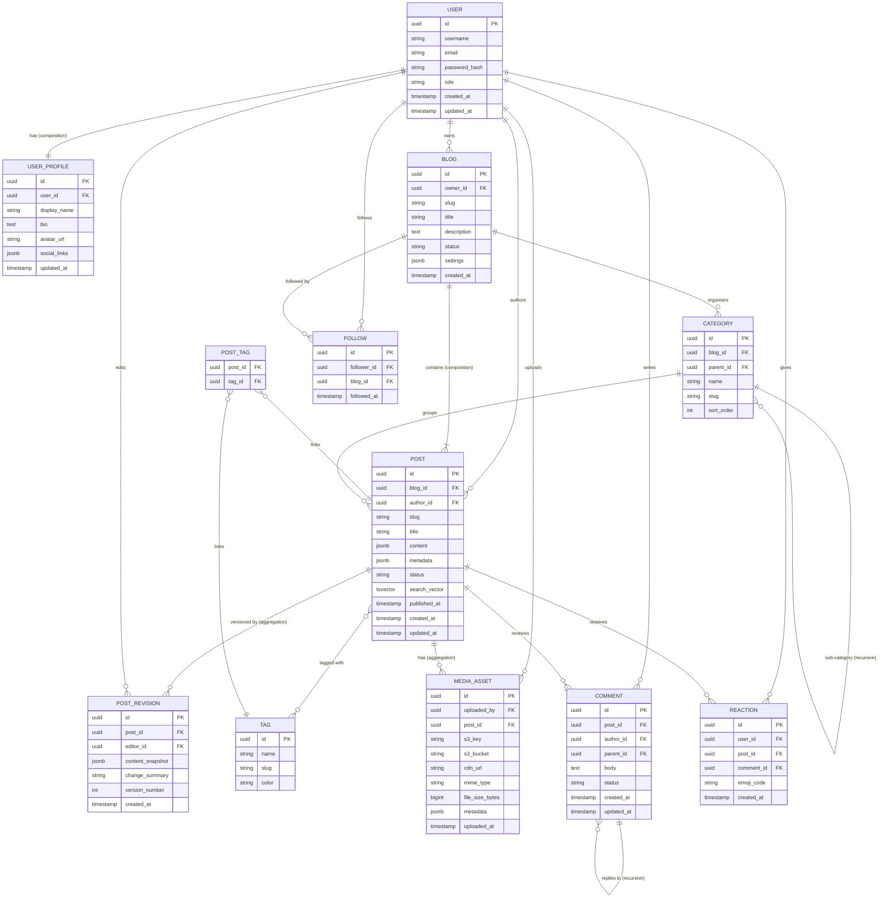

# 📝 Blog Platform

A full-featured **Blog Platform** built with **Spring Boot**, designed to support a rich content ecosystem including blogs, posts, comments, reactions, followers, media assets, tags, categories, and post revisions.

---

## 🚀 Features

| Feature | Description |
|---|---|
| **Blogs** | Users can own and manage one or more blogs with custom slugs, descriptions, and settings |
| **Posts** | Rich content posts with versioning, full-text search (`tsvector`), metadata, and publishing workflow |
| **Post Revisions** | Full revision history per post — track every edit with a content snapshot, editor, and version number |
| **Comments** | Threaded (recursive) comments on posts, with moderation status support |
| **Reactions** | Emoji-based reactions on both posts and comments |
| **Followers** | Users can follow any blog and get updates |
| **Tags & Categories** | Posts can be tagged and grouped into hierarchical categories (supports sub-categories) |
| **Media Assets** | Upload and attach media (images, files) to posts via S3/CDN integration |
| **User Profiles** | Extended user profiles with bio, avatar, and social links (stored as JSONB) |

---

## 🏗️ Architecture

The platform follows a layered Spring Boot architecture:

```
Controller → Service (Interface + Impl) → Repository (Spring Data JPA) → PostgreSQL
```

- **Database**: PostgreSQL with a dedicated `portfolio` schema
- **ORM**: Hibernate / Spring Data JPA
- **Content storage**: JSONB columns for flexible post content and metadata
- **Search**: Native PostgreSQL `tsvector` full-text search on posts
- **Media**: S3-compatible object storage with CDN URL references

---

## 🗂️ Entity Relationship Diagram

The ERD below shows all core entities and their relationships. Open [`architecture_docs/blog_platform_erd.html`](architecture_docs/blog_platform_erd.html) in a browser to view the interactive rendered diagram.



---

## ⚙️ Configuration

| Profile | File | Purpose |
|---|---|---|
| `dev` | `application-dev.properties` | Local development (PostgreSQL on localhost) |
| `int` | `application-int.properties` | Integration / staging environment |
| `prod` | `application-prod.properties` | Production environment |

Set the active profile via:
```
-Dspring.profiles.active=dev
```

All entities are stored under the **`portfolio`** schema inside the `blogdb` PostgreSQL database, configured via:
```properties
spring.jpa.properties.hibernate.default_schema=portfolio
```

---

## 🛠️ Tech Stack

- **Java 21** / **Spring Boot 3**
- **Spring Data JPA** + **Hibernate**
- **PostgreSQL** (with JSONB & tsvector support)
- **Lombok** (builder, getters/setters)
- **MapStruct** (DTO mapping)
- **OpenAPI / Swagger** (REST API spec at `rest_api/blog_api.yaml`)

---

## 📁 Project Structure

```
src/main/java/com/platform/blog/service/
├── blog/               # Blog aggregate (entity, controller, service, repo, dto)
├── config/             # Spring configuration classes
├── enums/              # Shared enumerations (e.g. BlogStatus)
├── exception/          # Global exception handling
├── interceptors/       # HTTP interceptors / filters
├── aspects/            # AOP aspects (e.g. logging)
└── shared/
    ├── domain/         # AbstractEntity (domain base)
    └── infrastructure/ # AbstractPersistenceEntity (JPA base)
```
